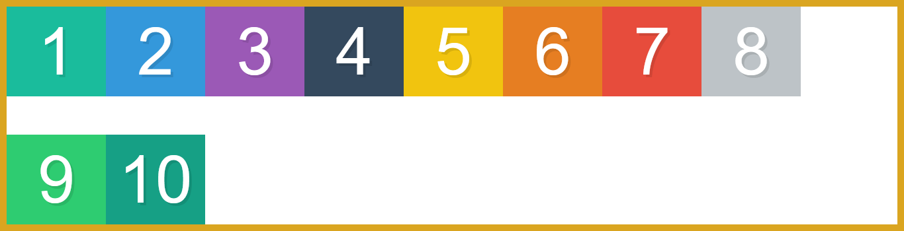

# Flexbox

Flexbox is a 1D layout method which means that flebox items can be layout in horinzontal or vertically axis at a time.

Flexbox provides a more efficient way to layout elements. It gives us the ability to align the items and distribute space among the items in a container - even though the size of the elements is unknown or dynamic. With the flexbox, we get the power of flexibility(as the word flex says) to fill the available space. So that elements can easily accommodate according to the size of screens. In a flexbox container, the item expands to fill the free space as well as shrinks to prevent overflow.

### Why flexbox?

Before the addition we used **floats** & **positioning** for layouting as these are trick they are never build for building layouts.

The following simple layout requirements are either difficult or impossible to achieve with such tools, in any kind of convenient, flexible way:

- Vertically centering a block of content inside its parent.
- Making all the children of a container take up an equal amount of the available width/height, regardless of how much width/height is available.
- Making all columns in a multiple column layout adopt the same height even if they contain a different amount of content.

### How does the flexbox model work?

The Flexbox model comes with some sets of properties. Few properties can be applied to parent containers and a few on children items. To make use of those properties and values we need to go into the flexbox zone.

To do so, apply `display: flex` style to an element. Once you do so the element automatically becomes "Flex Container" and children inside are "Flex Item" and we are in the zone of the flexbox model. Now we can use the flexbox properties. Without setting the element's style as `display: flex`, we cannot make use of any flexbox model property.


```html
    <style>
        /* Colours for each box */
        .box1 { background:#1abc9c;}
        .box2 { background:#3498db;}
        .box3 { background:#9b59b6;}

        /* We start writing out flexbox here. The above is just page setup */
        .container {
        display:flex;
        border:10px solid goldenrod;
        }
    </style>

    <div class="container">
        <div class="box box1">1</div>
        <div class="box box2">2</div>
        <div class="box box3">3</div>
    </div>
```

> #### Terminology:(Flex Container and Flex Items)
>
> While working with flexbox model, there are few basic terminologies that you need to keep in mind.
> For example `flex container` and `flex-item`.
>
> ##### 1. Flex Container
>
> The Parent element where you need to apply `display: flex`.
>
> ##### 2. Flex Items
>
> The children elements inside the flex container.
>
> 

In the flexbox model, few properties can be applied to `Flex Container` and few to `Flex Items`.

---

## Properties available to `Parent` only

let see each properties & what they does

- ### `display`:

The following properties enable a `flex` zone. In which all children act as `flex-items`. The `display` properties have two flex value

```css
.container {
    display: flex || inline-flex;
}
```

`display: flex` adding following make all childen in one line default as `row` & every element take width according to content. if children has width they take width value in consideration & try to fill container as possible or can overflow if can't fit on container. Also Container take full width as a `block` element


`display: inline-flex` The difference from above is that the parent will take width according to content width just like a `inline-block`.


- ### `flex-direction`:

Flex direction property determines the direction of the item in which they will lay down. By default when we set the property as display: flex, all items line up one after another horizontally. Technically, saying "horizontally" will be wrong here in the flexbox model. Instead, I must say items line up on the main axis. Now here is the time to discuss the two other terminologies i.e. main-axis and cross-axis.

> #### Terminology(main-axis and cross-axis)
>
> Actually, in the flexbox model, there are two axes: `main-axis` and `cross-axis`.
>
> ##### 1. Main Axis
>
> The `main-axis` in the flexbox model is the primary axis along which the items are laid out in the flex container.
> By default, the `main-axis` feels like "horizontal direction", from left to right.
>
> ##### 2. Cross Axis
>
> The cross-axis goes perpendicular to the `main-axis`. It feels like "vertical direction", top to bottom.
>


The important point is that the `main-axis` is not necessary to remain always in the horizontal direction. We can anytime interchange the direction of axes with the `flex-direction` property.

The `flex-direction` property can accept four values:

```css
.container {
    flex-direction: row || column || row-reverse || column-reverse;
}
```

###### Row(default)

```css
  .container {
    flex-direction: row;
  }
```

This is the default value for `flex-direction` property. After applying this property you won't find any changes.


###### Column

```css
  .container {
    flex-direction: column;
  }
```

This value makes all the items in the `flex-container` laid down top to bottom. The `column` value changes the direction of the axes in the flexbox model. The `main-axis` takes the place of `cross-axis` and the cross-axis takes the place of the main-axis.


###### Row Reverse

```css
  .container {
    flex-direction: row-reverse;
  }
```

The `row-reverse` is similar to row but this time all the items will sit from right to left means in the opposite direction.


###### Column Reverse

```css
  .container {
    flex-direction: column-reverse;
  }
```

The `column-reverse` is also opposite to the `column` value. The item will lay down from bottom to top.


- ### `flex-wrap`:

The `flex-wrap` property determines how the flex-container will accommodate if there are extra flex-items inside it.

By default all `flex-items` fit in single line if we more items too, if we resize a window you will find all element are in sameline & added horizontal scroll bar at some point resize.


For wrapping the items inside the flex container we have the flex-wrap property. The flex-wrap property comes with three different values:

```css
.container {
    display: flex;
    flex-wrap: nowrap (Default) | wrap | wrap-reverse;
}
```

###### No wrap(default)

```css
  .container {
    flex-wrap: nowrap;
  }
```

The nowrap value is the default value. By default, the container has the nowrap value for the flex-wrap property, whether we apply or not. The container will always accommodate all the items in a single line even although the browser needs to be scrolled horizontally.

###### Wrap

```css
  .container {
    flex-wrap: wrap;
  }
```


If the container does not has enough space to accommodate enough items in a single line, then `wrap` value items will automatically break into new lines.

###### Wrap Reverse

```css
  .container {
    flex-wrap: wrap-reverse;
  }
```


The wrap-reverse is similar to wrap value, but this value wraps the items in the reverse direction.

- ### `flex-flow`:


The `flex-flow` property is the shorthand property for `flex-direction` and `flex-wrap`. I hope we all know what are shorthand and longhand properties.

```css
  .container {
    flex-flow: row wrap;
  }
```

The `flex-flow` property accepts two values at a time, where the first value is for the `flex-direction` and the last value is for `flex-wrap`.

- ### `justify-content`:

The `justify-content` property defines how the items will be laid out on the "main-axis". It controls the alignment of the items on the "main-axis". It also helps to make use of extra space leftover in a flex container.

The justify-content property can take 6 different values:

```css
  .container {
    justify-content: flex-start || flex-end || center || space-between || space-around || space-evenly;
  }
```

###### Flex Start(default)

```css
  .container {
    justify-content: flex-start;
  }
```


This is the default value of `justify-content` property where all the flex-items will start from the starting point on the "main-axis". As we can see how the flex-items are being laid out from the starting point in a flex-container.

###### Flex End

```
  .container {
    justify-content: flex-end;
  }
```


All the flex-items are laid out towards the endpoint of the "main-axis".

###### Center

```css
  .container {
    justify-content: center;
  }
```

The 'center' value for 'justify-content' will center the flex-items along the "main-axis" line.


##### Space Between

```css
  .container {
    justify-content: space-between;
  }
```

The extra space in the flex container will be evenly distributed between the flex-items, where the first item in the container will stick to the starting point of the "main-axis" and the last item will stick to the endpoint of the main-axis.


###### Space Around

```css
  .container {
    justify-content: space-around;
  }
```

The extra space in the flex container will be evenly distributed around the flex-items on the "main-axis". Means on the left as well as on the right side of the flex-items there will equal amount of space.


###### Space Evenly

```css
  .container {
    justify-content: space-evenly;
  }
```

The extra space in the flex container will be distributed in such a way that, the space between any two items as well the space of the item from the edge of the container will be equal.


- ### `align-items`:

The `align-items` property is similar to `justify-content` property. The only difference is that the `align-items` property works on "cross-axis". It defines how the "flex-items" will be laid out on the "cross-axis" inside a "flex container".

The align-items property comes with four values:

```css
  .container {
    align-items: stretch || flex-start|| flex-end|| center || baseline;
  }
```

###### Stretch(default)

The stretch value for the align-items property is the default value. All the "flex-items" are stretched on the "cross-axis" to fill the extra space inside a container. By default, you won't see any effect on the items, because right now there is no extra space on the "cross-axis" inside the container. Let's apply some height(let's say 350px) to the container and thereafter see the changes.

```css
.container {
    display: flex;
    border:10px solid goldenrod;
    height: 350px;
    align-items: strech;
}
```


That's how all the flex-items behave in flexbox on "cross-axis". So without applying `align-items: stretch`, to the container the items are stretched out to fill the space on the "cross-axis".

###### Flex start

```css
.container {
    display: flex;
    border:10px solid goldenrod;
    height: 350px;
    align-items: flex-start;
}
```

As expected the flex-items will be laid out from the starting point on the "cross-axis" & taking height of their content.


###### Flex End

```css
.container {
    display: flex;
    border:10px solid goldenrod;
    height: 350px;
    align-items: flex-end;
}
```

As expected the flex-items will be laid out towards the endpoint on the "cross-axis".


###### Center

```css
  .container {
    display: flex;
    border:10px solid goldenrod;
    height: 350px;
    align-items: center;
  }
```

The `center` value for `align-items` property will center the flex-items along the "cross-axis" line.


###### Baseline

```html

<!-- HTML -->
<div class="container">
    <div class="box box1">1</div>
    <div class="box box2">2</div>
    <div class="box box3">3</div>
</div>

<!-- Style -->
<style>

.box {
  color:white;
  font-size: 100px;
  text-align: center;
  text-shadow:4px 4px 0 rgba(0,0,0,0.1);
  padding:10px;
}

/* Colours for each box */
.box1 { background:#1abc9c;}
.box2 { background:#3498db; font-size: 140px;}
.box3 { background:#9b59b6; font-size: 120px;}

.container {
    display: flex;
    border:10px solid goldenrod;
    height: 350px;
    align-items: baseline;
  }

</style>
```


The `baseline` value aligns the items based on the baseline of the text. Check out the image above for understanding.

> ###### To be not confused, always remember, "justify" works along the `main-axis` and "align" works along the `cross-axis`.

- ### `align-content`:

The align-content property is similar to both `justify-content` and `align-items` property.

The difference is that the `justify-content` and `align-items` property works on the individual items but the `align-content` property works on the multi-line flex container. The `align-content` property aligns flex container's lines when there is extra space on the cross-axis.

If all the "flex-items" are on a single line in a container then this property does not affect.

The align-content property accepts 6 different values:

```css
.container {
    align-content: stretch || flex-start || flex-end || center || space-between || space-around;
}
```

Let's add a few more flex items so that we have a multi-line flex-container. Remember this property does not affect single line flex-container.

```html
<div class="container">
    <div class="box box1">1</div>
    <div class="box box2">2</div>
    <div class="box box3">3</div>
    <div class="box box4">4</div>
    <div class="box box5">5</div>
    <div class="box box6">6</div>
    <div class="box box7">7</div>
    <div class="box box8">8</div>
    <div class="box box9">9</div>
    <div class="box box10">10</div>
</div>

<style>

/* Some default styles to make each box visible */
.box {
    color:white;
    width: 150px
    font-size: 100px;
    text-align: center;
    text-shadow:4px 4px 0 rgba(0,0,0,0.1);
    padding:10px;
}

/* Colours for each box */
.box1 { background:#1abc9c;}
.box2 { background:#3498db;}
.box3 { background:#9b59b6;}
.box4 { background:#34495e;}
.box5 { background:#f1c40f;}
.box6 { background:#e67e22;}
.box7 { background:#e74c3c;}
.box8 { background:#bdc3c7;}
.box9 { background:#2ecc71;}
.box10 { background:#16a085;}

.container {
    display: flex;
    flex-wrap: wrap;
    border:10px solid goldenrod;
    height: 350px;
}

</style>
```

###### Stretch(default)

```css
.container {
    display: flex;
    flex-wrap: wrap;
    align-content: stretch;
}
```

The stretch is the default value for the `align-content` property. All the items are stretched to take up the remaining space on the "cross-axis".

)

###### Flex Start

```css
.container {
    display: flex;
    flex-wrap: wrap;
    align-content: flex-start;
}
```

All the items in a multi-line flex container will be aligned from the starting point on the "cross-axis".


###### Flex End

```css
.container {
    display: flex;
    flex-wrap: wrap;
    align-content: flex-end;
}
```

All the items in a multi-line flex-container will be aligned towards the endpoint on the "cross-axis".


###### Center

```css
.container {
    display: flex;
    flex-wrap: wrap;
    align-content: center;
}
```

Items are laid out to the `center` of the multi-line flex-container on the "cross-axis".


###### Space Between

```css
.container {
    display: flex;
    flex-wrap: wrap;
    align-content: space-between;
}
```

The spaces are evenly distributed between the flex-items on the "cross-axis" as `justify-content: space-between` property works on the "main-axis".



###### Space Around

```css
.container {
    display: flex;
    flex-wrap: wrap;
    align-content: space-around;
}
```

The spaces are evenly distributed around the flex-items on the "cross-axis" as `justify-content: space-around` property works on the "main-axis".


---

## Properties available to `Children` only

The properties that can be applied to flex-items are:

`order`, `flex-grow`, `flex-shrink`, `flex-basis`, `flex`, `align-self`.

- ### `order`:

The `order` property is used to reorder the flex-item within a flex-container without changing the source code in an HTML document. By default, we know that the elements are laid out according to the order in which it is written in the HTML document.

However, we can reorder the place of items on a page with `order` property in the flexbox. For example, let's say we want our first item at the end.

```css
.box1 {
    order: 1
}
```


The `box1` will at the end because of its order 1. By default, every item has 0 value for the order property. The property accepts unitless value in number, it can be `negative` or `positive`. The items are reordered according to the values applied to the order property, from lowest to highest. If the order value for the items is the same then the items are laid out according to the order appeared in HTML source code.

- ### `flex-grow`:

The flex-grow property allows the items to grow if there is extra space inside the flex container. The property accepts unitless value in number which provides the ability to grow to the items.

By default, the value for the flex-grow property is `0`, which means the size of the item will be auto. It may accept any value but not negative. If we want the item to grow and fill the extra space inside the container, we will have to apply `flex-grow` property and set the value greater than `0`. Let's check out the property visually.

Suppose we have items inside a flex-container and we want the items to grow in the same proportionality. Then we can set the value 1 for `flex-grow` property for the items.

```css
.box {
    flex-grow: 1;
}
```


If all the items have `flex-grow` set to `1` the extra space will be distributed equally to all the items.

If one of the items has a value of 2, the remaining space would take up twice as much space as the others.

```css
.box {
    flex-grow: 1;
}

.box2 {
    flex-grow: 2;
}
```

if You inspect before `flex-grow` on any element & note `width` suppose it has width `130px` before & after `flex-grow: 1;` you will see all items get `width` increased it like the space is distriburted by `1:1:1`. In above our `.box2` had `flex-basis: 2` if you inspect the space is distributed to `box2` is twice the other.


- ### `flex-shrink`:

The `flex-shrink` property is opposite to the `flex-grow` property. It allows the items to shrink if there is no extra space in the container. For the practical view, just reduce the size of your screens. You will find the width of the items is also reducing as the size of screens is reducing.

By default, the value for `flex-shrink` property is 1. Similar to `flex-grow` property the `flex-shrink` property also accepts a unitless value but greater than `0`. Negative values are invalid.

```css
.box {
    width: 300px
}

.box1 {
    flex-shrink: 1;
}
.box2 {
    flex-shrink: 2;
}
.box3 {
    flex-shrink: 3;
}
```

In above we see when we resize window to smaller the `.box3` get shrinked at faster & then `.box2` after `.box1`


> Higher the value faster it shrink corresponding to others.

However, if we set 0 value for the flex-shrink property the item size won't reduce as per the size of the screens. The item will overflow in the flex container.

```css
.box2 {
  flex-shrink: 0;
}
```

The all flex-items have width of `300px` if we resize a screen you will find that it is not shrinking it is respecting a width.


- ### `flex-basis`:

The `flex-basis` property is somewhat similar to the width property, as it accepts the values(in px, %, em, rem, etc.) similar to the width property. The `flex-basis` property is applied to set a base width or size of the flex-item from where the item will grow or shrink if necessary.

By default, the value for flex-basis property is auto, which means the base size of the item will be computed based on the content inside it plus whatever the padding we will apply to the item.

```css
.box {
    flex-basis: 300px;
}
```


##### What is difference between `width` and `flex-basis`?

```css
.box {
    flex-basis: 300px
}
```

You don't find difference in `flex-basis` until you change `flex-direction: column`. we will see that now that now the `300px` is the height of the items where in `row` it was width. 

> The `flex-basis` work on main-axis

- ### `flex`:

The `flex` property is the shorthand property for the `flex-grow`, `flex-shrink`, and `flex-basis`.

```css
.box {
    flex: 0 1 auto;
}
```

This is the default value for the `flex` property where the first value is for `flex-grow`, second is for `flex-shrink` and the last value is for `flex-basis`. The last two value for flex property is optional.

```css
.box {
    flex:  1;
}
```

Here, 1 is the value for the flex-grow property, and the values for `flex-shrink` and `flex-basis` will be automatically set to the default.

It's better to go with the `flex` shorthand property, instead of applying `flex-grow`, `flex-shrink`, and `flex-basis` individually.

- ### `align-self`:

The `align-self` property is exactly similar to align-items property. It accepts all the same values as the `align-items` accepts. The only difference is that the `align-self` property is applied to the flex-items but the `align-items` property is applied to the flex container.

```css
  .container {
    align-self: auto || stretch || flex-start || flex-end || center || baseline;
  }
```

###### Auto

The `auto` value for `align-self` property inherits, whatever the value is set for `align-items` in the flex-container. If it is `flex-star`, the `align-self` value will be also `flex-start`.

```css
.container {
    align-items: stretch;
}

.box3 {
    align-self: auto;
}
```


###### Stretch

The `stretch` property is to stretch out the size of individual items on the "cross-axis" to fill the extra space.

```css
.box3 {
    align-self: stretch;
}
```


###### Flex Start

The item will be aligned from the starting point on the "cross-axis".

```css
.box3 {
    align-self: flex-start;
}
```


###### Flex End

The item will be aligned towards the endpoint on the "cross-axis".

```css
.box3 {
    align-self: flex-end;
}
```


###### Center

The item will be aligned at the center on the "cross-axis".

```css
.box3 {
    align-self: center;
}
```


###### Baseline

We have already seen baseline value for align-items property for the "flex-container". The baseline value for `align-self` property also works in the same way.

```css
.box3 {
    align-self: baseline;
}
```

---
> Note: float, clear, and vertical-align do not affect a flex item.
